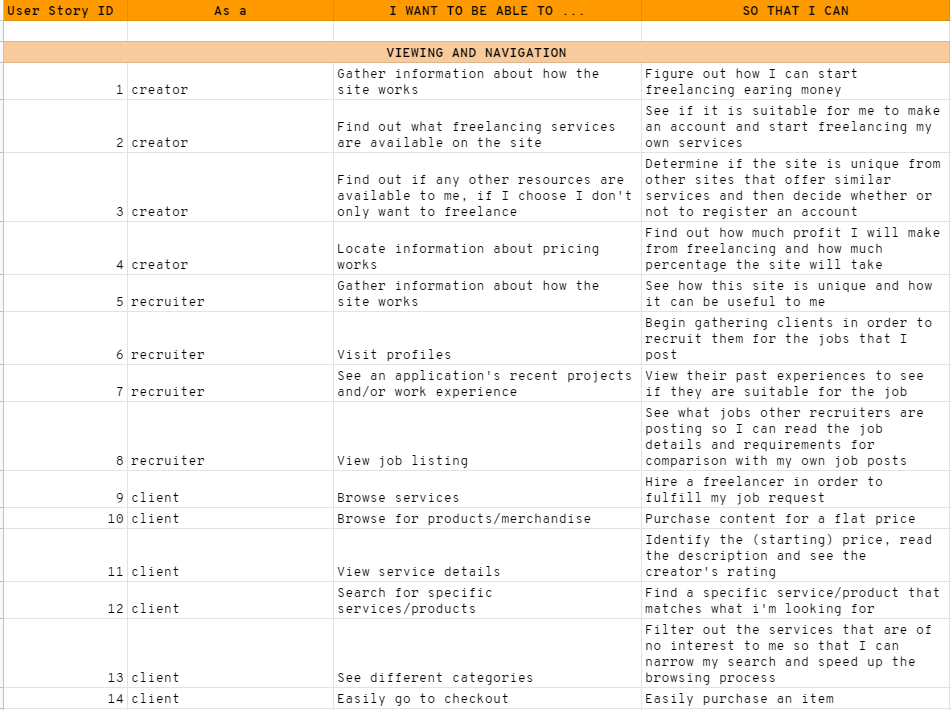

# Legion

## Contents 

- [UX](#ux)

    - [User Stories](#user-stories)

- [Contents](#contents)

    - [credits](#credits)

        - [Code](#code)

-----

## UX

### User Stories

The full spreedsheet that defines all of the user stories can be accessed [here](https://docs.google.com/spreadsheets/d/1KYb3yVm8IIQM_jBeD-Tyxuno-kC5TYOTrA6sQpfI36Y/edit?usp=sharing)

#### Viewing and Navigation

#### Registration and User Accounts

#### Purchasing a Service

#### Admin and Store Management

-----

## Contents

### Credits

#### Code

- I followed [this official documentation](https://docs.djangoproject.com/en/dev/topics/auth/customizing/#using-a-custom-user-model-when-starting-a-project) to create my own custom user model, which included removing the username from Allauth's registration functionality and adding my own required fields.

- When creating the custom user model, I had to reset the database in order to make migrations work correctly. To do that I used [Django Extensions](https://django-extensions.readthedocs.io/en/latest/), which allowed me to use the command line to easily reset the database. [This source](https://stackoverflow.com/questions/2289187/complete-django-db-reset) led me to use such a method.

- I used [this source](https://www.fullstackpython.com/django-utils-timezone-now-examples.html) to set a default for DateField in my models.

- I used [this source](https://github.com/Tivix/django-rest-auth/issues/261) to fix 'NoModuleError' for user. Adding `ACCOUNT_USER_DISLAY = lambda user: user.get_username()` to settings.py fixed this error and got Allauth's confirmation email functionality working correctly.

- The code above would throw a PEP8 violation warning due to the use of a lambda. I used [this source](https://stackoverflow.com/questions/25010167/e731-do-not-assign-a-lambda-expression-use-a-def) to change it to `def ACCOUNT_USER_DISPLAY(user): return user.get_username()`

- To add placeholders to the custom user models for the account registration/login forms, I looked to [this source](https://izziswift.com/how-do-i-add-a-placeholder-on-a-charfield-in-django/)

- For handling background images, I based my CSS code from [this source](https://www.sitepoint.com/css3-transform-background-image/) and also [this source](https://css-tricks.com/almanac/properties/b/background-position/)

- I used [this source](https://www.geeksforgeeks.org/custom-field-validations-in-django-models/) to make a custom validation error for the date of birth input field on the registration form.

- I used [this source](https://www.tutorialsrack.com/articles/205/how-to-get-the-year-month-and-day-from-a-datetime-in-python) for help on using the date and time python modules, which was used to create the custom validation error for the date of birth input field.

- To make an input field hidden with Django forms, I used [this source](https://stackoverflow.com/questions/6862250/change-a-django-form-field-to-a-hidden-field)

- I used [this source](https://stackoverflow.com/questions/29716023/add-class-to-form-field-django-modelform) to add classes to form fields with Django.

- I looked to [this source](https://stackoverflow.com/questions/20100055/add-class-on-sibling-next-to-element) and [this source](https://stackoverflow.com/questions/2607592/jquery-add-next-to-add-after) for help with minipulating elements in the DOM with JQuery. In particular, this was used to add Materialize switch classes a Django checkbox input field.

- I used [this source](https://stackoverflow.com/questions/10159214/why-does-dynamically-changing-a-checkbox-not-trigger-a-form-change-event) to add a required attribute to a form when once a checkbox is checked.

- I used [this guide](https://simpleisbetterthancomplex.com/tutorial/2018/01/18/how-to-implement-multiple-user-types-with-django.html) for help with implementing mutilple user types into my project, as well as extending the user model.

- I used [this source](https://stackoverflow.com/questions/18676156/how-to-properly-use-the-choices-field-option-in-django) and [this source](https://docs.djangoproject.com/en/3.0/ref/models/fields/#enumeration-types) for helping with implementing a ChoiceField into my UserProfile model.

- [This source](https://www.geeksforgeeks.org/python-relational-fields-in-django-models/) was useful for understanding how to properly use the OneToOneField, ManyToManyField and ForeignKey field with Django. I also used [this offical documentation](https://docs.djangoproject.com/en/3.2/topics/db/examples/one_to_one/) as a further guide and [this source](https://stackoverflow.com/questions/5870537/whats-the-difference-between-django-onetoonefield-and-foreignkey) for help with deciding whether or not to use a ForeignKey or OneToOneField.

- For accessing data with one-to-one relationships, I looked to [this source](https://djangowaves.com/resources/django-one-to-one-field/) as help.

- I looked to [this source](https://www.codewall.co.uk/jquery-checkbox-checked-check-get-set-value/) for accessing and minipulating checkboxes with the JQuery and JavaScript.

- I used [this source](https://stackoverflow.com/questions/3165413/how-to-get-input-type-using-jquery) to determine an input field type with JQuery.

- When trying to add the user profile to the admin, I would recieve a `User has no profile` error. [This source](https://stackoverflow.com/questions/36317816/relatedobjectdoesnotexist-user-has-no-userprofile) helped me address and fix the issue.

- [This source](https://stackoverflow.com/questions/26312219/operationalerror-no-such-column-django) helped me fix an operational error, `no such collumn` when working with the optional input fields in the user profile model.

- I used [this source](https://stackoverflow.com/questions/38787889/django-admin-edit-fields-of-one-to-one-model-class) to implement inlines in the admin.

- I used [this source](https://stackoverflow.com/questions/11235622/jquery-disable-form-submit-on-enter) to disable form submission upon hitting the enter key.

- I used [this source](https://www.w3docs.com/snippets/javascript/how-to-check-if-an-enter-key-is-pressed-with-jquery.html) to check if the enter key was pressed.

- [This source](http://www.learningaboutelectronics.com/Articles/How-to-create-radio-buttons-in-a-Django-form.php) was used to create radio buttons with a Django form choice field.

- I used [this source](https://stackoverflow.com/questions/1524916/remove-value-of-input-using-jquery) to remove the value of an input field with JQuery.

- I used [this source](https://stackoverflow.com/questions/61550004/check-if-string-contains-any-letter-javascript-jquery) to check if an input field contained valid input. It was used to prevent strings with only whitespace and/or special characters.

- I used [this](https://stackoverflow.com/questions/15210511/django-modelchoicefield-optgroup-tag) and [this](https://docs.djangoproject.com/en/3.0/ref/models/fields/#enumeration-types) source to implement optgroups into my Django choice field.

- I used [this source](https://stackoverflow.com/questions/1571076/remove-text-with-jquery) along with the Jquery `.wrap()` function to wrap text in a heading.

- I used [this source](https://stackoverflow.com/questions/3408150/add-attribute-checked-on-click-jquery) to add the checked attribute to a radio tag with JQuery.

- I used [this source](https://stackoverflow.com/questions/347798/changing-an-elements-id-with-jquery) to access and change an element ID attribute with JQuery.

- I used [this source](https://stackoverflow.com/questions/17901341/django-how-to-make-a-variable-available-to-all-templates) to create a custom context processor in the profiles app, for accessing the user's profile across multiple pages.

- I used [this source](https://stackoverflow.com/questions/42311548/pass-argument-to-view-with-reverse-django) to pass an argument to the view with Django reverse.

#### Acknowledgements

- I want to say thank you to Igor and Scott from Code Institute for their help with some features.

- I also want to thank my mentor, Can Sucullu, for his help and valuable suggestions throughout this project.

- Finally, I want to thank friends and family members for their continual support and feedback.