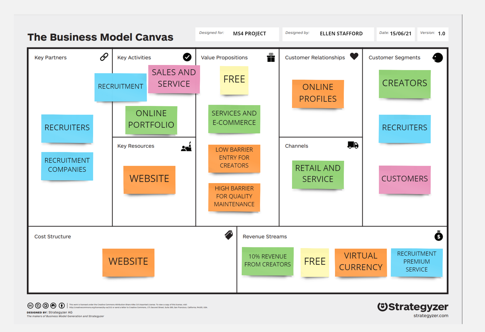
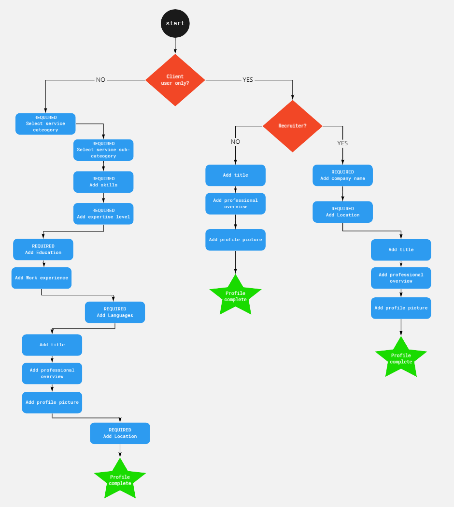
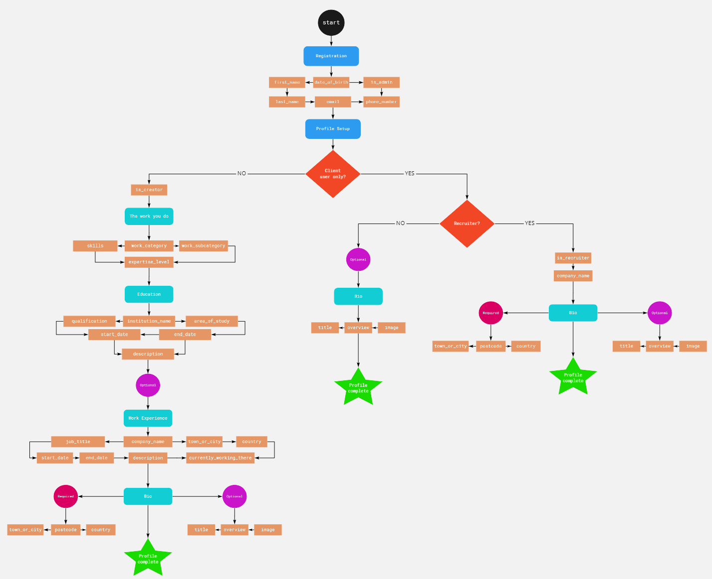

# Legion


## Contents 

- [UX](#ux)

    - [User Stories](#user-stories)

    - [Strategy Plane](#strategy-plane)

    - [Bussiness Model](#bussiness-model)

    - [Structure Plane](#structure-plane)

- [Deployment](#deployment)

    - [Heroku](#heroku)

    - [AWS](#aws)

- [Credits](#credits)

    - [Code](#code)


-----

## UX


### Strategy Plane


#### Project Purpose

Legion is a professional, online marketplace that connects businesses with freelancers and creative job-seekers, while providing a professional space for creators to freelance their services and talent. Legion is also a platform for job-seekers to promote their online portfolios and look for jobs. Additionally, it provides an easy, user friendly platform for independent business owners and/or recruitment companies to post job listings and look for talented individuals to hire. 

The purpose of Legion is to compete with known platforms like LinkedIn, Fiverr and Upwork, by providing a new, distinct platform for individuals to connect with business and vice versa. Legion is also open to smaller, independent companies who wish to hire freelance services. Legion aims to provide a professional, easy and secure space for people to network and grow their business and/or online presence. What makes it different is its approach, as Legion takes on an aesthetic which is similar to social media platforms like Instagram. This makes Legion easy to navigate and makes the user experience much more enjoyable.


#### Site Owner Goals

The primary goal is to establish a professional and secure community to unite freelancers, job seekers and businesses. If the project was a real-world application, then another goal would be to generate site revenue by taking a percentage of money made freelancing and offering premium memberships to business owners and/or recruiters. The project has implemented its features to represent this real-world goal.


#### Target Audience

Legion has two primary types of users at the center of its target audience: the client and the creator. The client may be part of a recruitment company; the head of a large business, or a smaller independent business owner looking for freelance services. If the user is a recruiter, then they may use the site to post job listings or look for talented individuals to employ. The creator is the freelancer and/or job seeker, who will use the site to freelance their services, look for jobs, establish their online presence through a portfolio and network by making and building connections.


#### Business Model

Below is my business model, which was built using the [Strategyzer](https://www.strategyzer.com/) business model canvas. [Micro](https://miro.com/) was used to add post it notes. The business model canvas was created during the planning phase of the project and influenced the user stories and helped prioritize features.




-----


### User Stories

The full spreedsheet that defines all of the user stories can be accessed [here](https://docs.google.com/spreadsheets/d/1KYb3yVm8IIQM_jBeD-Tyxuno-kC5TYOTrA6sQpfI36Y/edit?usp=sharing)

#### Viewing and Navigation


#### Registration and User Accounts


#### Purchasing a Service


#### Admin and Store Management


-----

### Structure Plane

Below is a diagram illustrating the different steps used to define the user model and its user type:






-----

## Deployment


### Heroku

1. First you will need Heroku's `PostGres` add on to ensure that the sqlite file-based database can work once deployed. Search for PostGres in  the **Resources** tab in Heroku. 

2. Add the add on. You will now see a `DATABASE_URL` within the config vars.

3. Install the following packages to your app: `pip3 install dj-database-url`, `pip3 install psycopg2-binary`

4. Import dj-database-url in your settings.py file: `import dj_database_url`

5. To get database to work on the deployed version, we need to tell the app to use the PostGres `DATABASE_URL` from Heroku. However, we still want to use the default database setting when running the project locally. To fix this issue you need to connect to sqlite when using the local version, and postgres for the deployed version. Do by updating the database settings to the following:
```
if 'DATABASE_URL' in os.environ:
    DATABASES = {
        'default': dj_database_url.parse(os.environ.get('DATABASE_URL'))
    }
else:
    DATABASES = {
        'default': {
            'ENGINE': 'django.db.backends.sqlite3',
            'NAME': BASE_DIR / 'db.sqlite3',
        }
    }
```

6. To ensure that the databases work correctly, we need a few things. First install **unicorn** using `pip3 install gunicorn`. Don't forget to update your requirements.txt by using `pip3 freeze > requirements.txt`.

7. Remember, because you are now connected to Postgres, you need to run migrations again with `python3 manage.py migrate`.

8. Since we’re now using a different database, it won’t have any of our models or user information in it. To fix that, we need it to match the sqlite3 database by importing all of your data by using your fixtures, using the following command syntax: `python3 manage.py loaddata <object>`. Ensure that any tables with dependencies are loaded first to avoid any issues. E.g. `python3 manage.py loaddata categories` should be done **before** `python3 manage.py loaddata subcategories`.

9. Finally, set your superuser again so that it can work in the deployed site, using `python3 manage.py createsuperuser`.

10. Now you can create your Procfile to tell Heroku to create a web dyno which will run unicorn and serve our django app, using the following syntax: `web: gunicorn <app_name>.wsgi:application`. In my case, this is: `web: gunicorn legion.wsgi:application`

11. If you aren't logged in to Heroku already, log in via the CL using `heroku login -i`. You also may need to initialize your heroku git remote, using: `heroku git:remote -a <appname>`

12. Temporarily disable `collectstatic` so that Heroku won't collect static files when deploying the app, using `heroku config:set DISABLE_COLLECTSTATIC=1 --app <appname>`. This will be added to your config vars in Heroku.

13. Add the hostname of your Heroku app to `allowed_hosts` in `settings.py`. Add localhost also so that your local version will still work. **Note** if you are using Visual Studio code, then you may need to add or change `localhost` to '127.0.0.1' to ensure that the application can still run locally. Below is what it may look like in your settings:
```
ALLOWED_HOSTS = ['my-legion-app.herokuapp.com', 'localhost', '127.0.0.1']
```

14. Commit changes and push to GitHub. Then push to heroku by using `git push heroku master`.

15. Within Heroku, navigate to the **Deploy** tab and **Enable Automatic Deploys** to sync Heroku to your GitHub repository.

16. Generate a secret Django key using a generator, and add it to your config variables in Heroku. Then in your` setting.py` file, update your `SECRET_KEY` settings and your `Debug` settings to the following:
```
SECRET_KEY = os.environ.get('SECRET_KEY', '')

DEBUG = 'DEVELOPMENT' in os.environ
```


### AWS

Amazon AWS was used to store the application's static and media files. Listed below are the required steps to get AWS running correctly.

Create an AWS account and work your way through the registration process. 

#### Create Bucket

1. Once your account is created, navigate to the services tab and searh for **S3**, click on it to get started.

2. Create a new bucket via the AWS S3 service by clicking the `create bucket` button. 

3. Enter your bucket name. It's good practice to name the bucket to match the Heroku app name. In my case, my bucket name was `my-legion-app`, which matches the name on Heroku.

4. Select the region that is closest to you and uncheck `block all public access` and acknowledge that the bucket will be public.

5. Click `create bucket` to create your bucket.


#### Bucket Settings

1. Click on your new bucket to navigate to its settings.

2. Once there, first click the **properties** tab to turn on static website hosting.

3. Scroll down to **Static website hosting** and click edit. Ensure that `static website hosting` is enabled, and add the default values to index document and error document, which would be 'index.html' and 'error.html'. Once done, click **save changes**.

4. Next, navigate to the **permissions** tab, and scroll down to the **Cross-origin resource sharing (CORS)** section. Click the edit button and paste in the following code:
```
[
    {
        "AllowedHeaders": [
            "Authorization"
        ],
        "AllowedMethods": [
            "GET"
        ],
        "AllowedOrigins": [
            "*"
        ],
        "ExposeHeaders": []
    }
]
```

5. Then navigate to **Bucket policy** and click the edit button. Click **Policy generator** to generate a security policy for your bucket. 

6. Choose `S3 Bucket Policy` for your **policy type**.

7. Allow **all** principles by adding a `*` to the **Principal** field.

8. Select `Get Object` in the **Actions** select field.

9. Copy the **Amazon ARN** from the previous tab (your bucket policy tab) and copy your `Bucket ARN` and paste it into the **Amazon Resource Name ARN** field.

10. Click **Add statement** and then **Generate policy**, and then copy the generated policy into the bucket policy editor. Before you click save, add `/*` to the end of your Resource url to allow full access to all resources in the bucket. It may look something like this:
```
"Resource": "arn:aws:s3:::my-legion-app/*"
```

11. Finally, navigate to the **Access Control List** section, still within the Permissions tab, to set the **List Objects** permission to **Everyone** under the **Public Access** section.


#### Create a User Access

1. Navigate to the AWS Services menu and search for **IAM**. IAM stands for Identity and Access Management and will allow a user to access the S3 bucket we have created.

2. First we want to create a group for our user to live in. To do that, click on the **User Groups** tab in the sidenav, and create a new group by clicking the **Create group** button to your right. Give the group a name that is relevant to your application and purpose. In my case, I named the group `manage-legion-app`. Click **Create group** to create your new group.

3. Next, navigate to the **Policies** tab in the sidenav and click **Create Policy**.

4. Navigate to the JSON tab and click **Import managed policy** to import a AWS pre-built policy for full access to S3.

5. Search for **S3** and then import the **AmazonS3FullAccess** policy.

6. However we only want full access to *our* bucket and everything within it, to do that we are going to create a group access policy to give group access to the S3 bucket we have created.

7. Using a new tab so you don't loose the one you are currently on, navigate to the **bucket policy page** in S3 to get the bucket ARN. Paste that into **Resources** inside the JSON tab inside **IAM**. You'll also want to add another rule for all files and folders in the bucket. Look below for an example:
```
"Statement": [
    {
        "Effect": "Allow",
        "Action": "s3:*",
        "Resource": [
            "arn:aws:s3:::my-legion-app",
            "arn:aws:s3:::my-legion-app/*"
        ]
    }
]
```

8. Click Next, and next again to navigate to **Review Policy**. Give your policy a name and description then click **Create Policy**.

9. Now navigate back to the **User Groups** tab in the sidenav and click on the group you create before. In the **Permissions** tab, click **Add Permissions** and then **Attach Policies**. Search for the policy you just created, check it and click **Add Permissions**. 

10. Finally, we want to assign the user to the group, so that it can use the policy to access the files within the application.

11. Navigate to the **Users** tab in the sidenav and click **Add User**. Create a user using the following syntax `<appname>-staticfiles-user`, which in my case is, `legion-staticfiles-user`, give them **programmatic access** and select **Next**.

12. Now you and add the user to your group with the policy attached by clicking on the group name you just created.

13. Click through until the end and click **Create user**.

14. Finally click **Download .csv** - a CSV file containing the user access key and secret access key - which you will use in the Django app. Note that you cannot go through this process again so ensure that you keep this file safe.


#### Connect to Django and Add Static Files

1. Add the AWS **Access Key ID** and **Secret Access Key** that you just downloaded in the previous step to your config vars in Heroku. Also add the variable `USE_AWS: True`.

2. In your project, install the boto3 and django-storages using the following commands: `pip3 install boto3`, `pip3 install django-storages`. Remember to freeze your requirements.txt file by using the command: `pip freeze > requirements.txt`.

3. Add storages to your installed apps.

4. Next we need to tell Django which bucket it should be communicating with. We’ll only want to do this on Heroku so use an if statement to check if there’s an environment variable called `USE_AWS` in the environment, and if so define the `AWS_STORAGE_BUCKET_NAME` and `AWS_S3_REGION_NAME` and also the access key and secret access key which we’ll get from the environment. Additionally, you need to tell Django where the static files will be coming from in production, which is going to be the bucket name from AWS, stored inside the `AWS_S3_CUSTOM_DOMAIN`. It’s very important to keep these keys secret, because if they end up in version control, someone could use them to store or move data through your S3 bucket and Amazon would charge your card.

5. Your settings file may now look something like this:
```
if 'USE_AWS' in os.environ:
    AWS_STORAGE_BUCKET_NAME = 'my-legion-app'
    AWS_S3_REGION_NAME = 'eu-west-2'
    AWS_ACCESS_KEY_ID = os.environ.get('AWS_ACCESS_KEY_ID')
    AWS_SECRET_ACCESS_KEY = os.environ.get('AWS_SECRET_ACCESS_KEY')
    AWS_S3_CUSTOM_DOMAIN = f'{AWS_STORAGE_BUCKET_NAME}.s3.amazonaws.com'
```

6. If it exists, remove the `DISABLE_COLLECTSTATIC` from your Heroku config vars as this time django will collect static files automatically and upload them to S3.

7. The next step is to tell Django that in production, we want to use S3 to store static files whenever someone runs `collectstatic`, and that any uploaded product images should go there also. To do that create a new py file called `custom_storages.py` and import your settings and s3boto3 storage class. Paste the following code inside:
```
from django.conf import settings
from storages.backends.s3boto3 import S3Boto3Storage


class StaticStorage(S3Boto3Storage):
    location = settings.STATICFILES_LOCATION


class MediaStorage(S3Boto3Storage):
    location = settings.MEDIAFILES_LOCATION
```

8. The last step is to go to `settings.py` and tell it that we want to use our storage class for static file storage, and that the location it should save static files to is a folder called **static**, and then do the same thing for media files. We also need to override and explicitly set URLS for static and media files using our custom domain and the new locations. Add the following code below the code you added in **step 5**:
```
# Static and media files
STATICFILES_STORAGE = 'custom_storages.StaticStorage'
STATICFILES_LOCATION = 'static'
DEFAULT_FILE_LOCATION = 'custom_storages.MediaStorage'
MEDIAFILES_LOCATION = 'media'

# Override static and media URLS in production
STATIC_URL = f'https://{AWS_S3_CUSTOM_DOMAIN}/{STATICFILES_LOCATION}/'
MEDIA_URL = f'https://{AWS_S3_CUSTOM_DOMAIN}/{MEDIAFILES_LOCATION}/'
```

9. Add `AWS_S3_OBJECT_PARAMETERS` to tell the browser it’s okay to cache static files for a long time to improve performance:
```
AWS_S3_OBJECT_PARAMATERS = {
    'Expires': 'Thu, 31 Dec 2099 20:00:00 GMT',
    'CacheControl': 'max-age=94608000',
}
```

#### Add Media Files to S3

1. Navigate to your bucket in S3 and create a **new folder** called **media**.

2. Inside click **upload** and select all images from your project directory.

3. Under the **Permissions** tab, check **Grant public read-access** to these objects.

4. Click Upload to upload your media files.


### Stripe and Heroku

1. Create a Stripe account if you haven't done so already and navigate to **API Keys** under the **Developers** tab.

2. From there, find and copy `STRIPE_PUBLIC_KEY` and `STRIPE_SECRET_KEY` and paste them into the Heroku config vars. Give them the same name so that they can be accessed by your application.

3. To setup a webhook, navigate to to the **Webhooks** tab on Stripe, and click **Add Endpoint**. In there paste in the appropriate url for your application. For me this was `
https://my-legion-app.herokuapp.com/checkout/wh/` and check *recieve all events**. Add the endpoint.

4. You can now reveal your webhook signing secret, which you can add to Heroku config variables as done before. 

5. Ensure all your variable names match the names defined in `settings.py`.

6. Send a test webhook from Stripe to ensure that the listener is working by clicking **send test webhook**.


-----

## Credits

#### Code

- I followed [this official documentation](https://docs.djangoproject.com/en/dev/topics/auth/customizing/#using-a-custom-user-model-when-starting-a-project) to create my own custom user model, which included removing the username from Allauth's registration functionality and adding my own required fields.

- When creating the custom user model, I had to reset the database in order to make migrations work correctly. To do that I used [Django Extensions](https://django-extensions.readthedocs.io/en/latest/), which allowed me to use the command line to easily reset the database. [This source](https://stackoverflow.com/questions/2289187/complete-django-db-reset) led me to use such a method.

- I used [this source](https://www.fullstackpython.com/django-utils-timezone-now-examples.html) to set a default for DateField in my models.

- I used [this source](https://github.com/Tivix/django-rest-auth/issues/261) to fix 'NoModuleError' for user. Adding `ACCOUNT_USER_DISLAY = lambda user: user.get_username()` to settings.py fixed this error and got Allauth's confirmation email functionality working correctly.

- The code above would throw a PEP8 violation warning due to the use of a lambda. I used [this source](https://stackoverflow.com/questions/25010167/e731-do-not-assign-a-lambda-expression-use-a-def) to change it to `def ACCOUNT_USER_DISPLAY(user): return user.get_username()`

- To add placeholders to the custom user models for the account registration/login forms, I looked to [this source](https://izziswift.com/how-do-i-add-a-placeholder-on-a-charfield-in-django/)

- For handling background images, I based my CSS code from [this source](https://www.sitepoint.com/css3-transform-background-image/) and also [this source](https://css-tricks.com/almanac/properties/b/background-position/)

- I used [this source](https://www.geeksforgeeks.org/custom-field-validations-in-django-models/) to make a custom validation error for the date of birth input field on the registration form.

- I used [this source](https://www.tutorialsrack.com/articles/205/how-to-get-the-year-month-and-day-from-a-datetime-in-python) for help on using the date and time python modules, which was used to create the custom validation error for the date of birth input field.

- To make an input field hidden with Django forms, I used [this source](https://stackoverflow.com/questions/6862250/change-a-django-form-field-to-a-hidden-field)

- I used [this source](https://stackoverflow.com/questions/29716023/add-class-to-form-field-django-modelform) to add classes to form fields with Django.

- I looked to [this source](https://stackoverflow.com/questions/20100055/add-class-on-sibling-next-to-element) and [this source](https://stackoverflow.com/questions/2607592/jquery-add-next-to-add-after) for help with minipulating elements in the DOM with JQuery. In particular, this was used to add Materialize switch classes a Django checkbox input field.

- I used [this source](https://stackoverflow.com/questions/10159214/why-does-dynamically-changing-a-checkbox-not-trigger-a-form-change-event) to add a required attribute to a form when once a checkbox is checked.

- I used [this guide](https://simpleisbetterthancomplex.com/tutorial/2018/01/18/how-to-implement-multiple-user-types-with-django.html) for help with implementing mutilple user types into my project, as well as extending the user model.

- I used [this source](https://stackoverflow.com/questions/18676156/how-to-properly-use-the-choices-field-option-in-django) and [this source](https://docs.djangoproject.com/en/3.0/ref/models/fields/#enumeration-types) for helping with implementing a ChoiceField into my UserProfile model.

- [This source](https://www.geeksforgeeks.org/python-relational-fields-in-django-models/) was useful for understanding how to properly use the OneToOneField, ManyToManyField and ForeignKey field with Django. I also used [this offical documentation](https://docs.djangoproject.com/en/3.2/topics/db/examples/one_to_one/) as a further guide and [this source](https://stackoverflow.com/questions/5870537/whats-the-difference-between-django-onetoonefield-and-foreignkey) for help with deciding whether or not to use a ForeignKey or OneToOneField.

- For accessing data with one-to-one relationships, I looked to [this source](https://djangowaves.com/resources/django-one-to-one-field/) as help.

- I looked to [this source](https://www.codewall.co.uk/jquery-checkbox-checked-check-get-set-value/) for accessing and minipulating checkboxes with the JQuery and JavaScript.

- I used [this source](https://stackoverflow.com/questions/3165413/how-to-get-input-type-using-jquery) to determine an input field type with JQuery.

- When trying to add the user profile to the admin, I would recieve a `User has no profile` error. [This source](https://stackoverflow.com/questions/36317816/relatedobjectdoesnotexist-user-has-no-userprofile) helped me address and fix the issue.

- [This source](https://stackoverflow.com/questions/26312219/operationalerror-no-such-column-django) helped me fix an operational error, `no such collumn` when working with the optional input fields in the user profile model.

- I used [this source](https://stackoverflow.com/questions/38787889/django-admin-edit-fields-of-one-to-one-model-class) to implement inlines in the admin.

- I used [this source](https://stackoverflow.com/questions/11235622/jquery-disable-form-submit-on-enter) to disable form submission upon hitting the enter key.

- I used [this source](https://www.w3docs.com/snippets/javascript/how-to-check-if-an-enter-key-is-pressed-with-jquery.html) to check if the enter key was pressed.

- [This source](http://www.learningaboutelectronics.com/Articles/How-to-create-radio-buttons-in-a-Django-form.php) was used to create radio buttons with a Django form choice field.

- I used [this source](https://stackoverflow.com/questions/1524916/remove-value-of-input-using-jquery) to remove the value of an input field with JQuery.

- I used [this source](https://stackoverflow.com/questions/61550004/check-if-string-contains-any-letter-javascript-jquery) to check if an input field contained valid input. It was used to prevent strings with only whitespace and/or special characters.

- I used [this](https://stackoverflow.com/questions/15210511/django-modelchoicefield-optgroup-tag) and [this](https://docs.djangoproject.com/en/3.0/ref/models/fields/#enumeration-types) source to implement optgroups into my Django choice field.

- I used [this source](https://stackoverflow.com/questions/1571076/remove-text-with-jquery) along with the Jquery `.wrap()` function to wrap text in a heading.

- I used [this source](https://stackoverflow.com/questions/3408150/add-attribute-checked-on-click-jquery) to add the checked attribute to a radio tag with JQuery.

- I used [this source](https://stackoverflow.com/questions/347798/changing-an-elements-id-with-jquery) to access and change an element ID attribute with JQuery.

- I used [this source](https://stackoverflow.com/questions/17901341/django-how-to-make-a-variable-available-to-all-templates) to create a custom context processor in the profiles app, for accessing the user's profile across multiple pages.

- I used [this source](https://stackoverflow.com/questions/42311548/pass-argument-to-view-with-reverse-django) to pass an argument to the view with Django reverse.

- [This source](https://cssboxshadow.com/border-radius/) was used to create a box shadow with css.

- I used [this](https://stackoverflow.com/questions/57337720/writing-django-signup-form-tests-for-checking-new-user-creation#61447865) and [this source](https://www.valentinog.com/blog/testing-modelform/) for helping write my unit testing with Django.

- Both [this](https://pythonprogramming.net/messages-django-tutorial/) and [this source](https://stackoverflow.com/questions/41711127/how-to-extract-django-form-errors-message-without-the-html-tags) was used to add Django messages with Materialize toasts.

- I used [this source](https://makeitspendit.com/fix-jquery-click-event-not-working-with-dynamically-added-elements/) to get the JQuery `.click()` or `.on('click')` event to work with dynamically added elements.

- I used [this source](https://stackoverflow.com/questions/5613834/convert-string-to-variable-name-in-javascript) to access a variable defined in JavaSript via a string.

- I used [this source](https://stackoverflow.com/questions/25028040/jquery-horizontal-scroll-using-buttons) to add horizontal scrolling to a div.

- [This source](https://stackoverflow.com/questions/36581504/materialize-carousel-slider-autoplay) was used to the add autoplay to the Materialize carousel on the home page.


#### Acknowledgements

- I want to say thank you to Igor, Jo, John, Sheryl, and Scott from Code Institute for their help with some features.

- I also want to thank my mentor, Can Sucullu, for his help and valuable suggestions throughout this project.

- Finally, I want to thank friends and family members for their continual support and feedback.